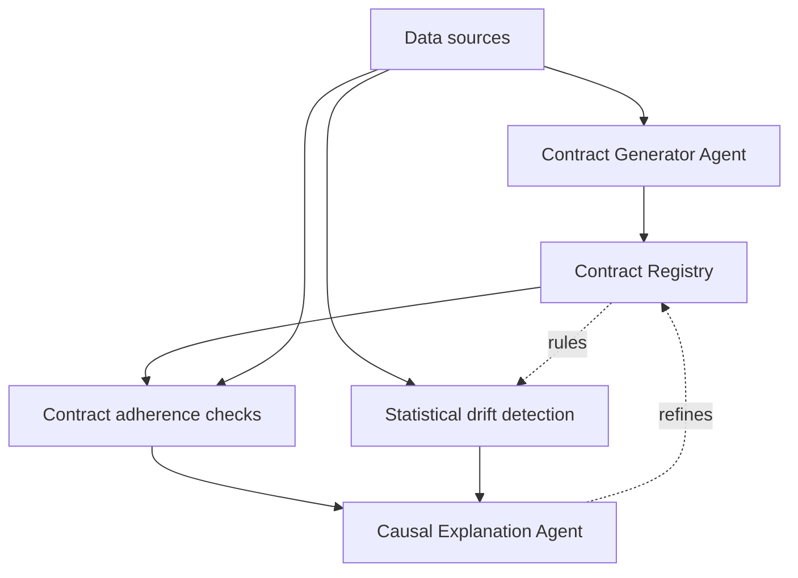
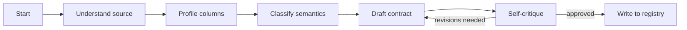
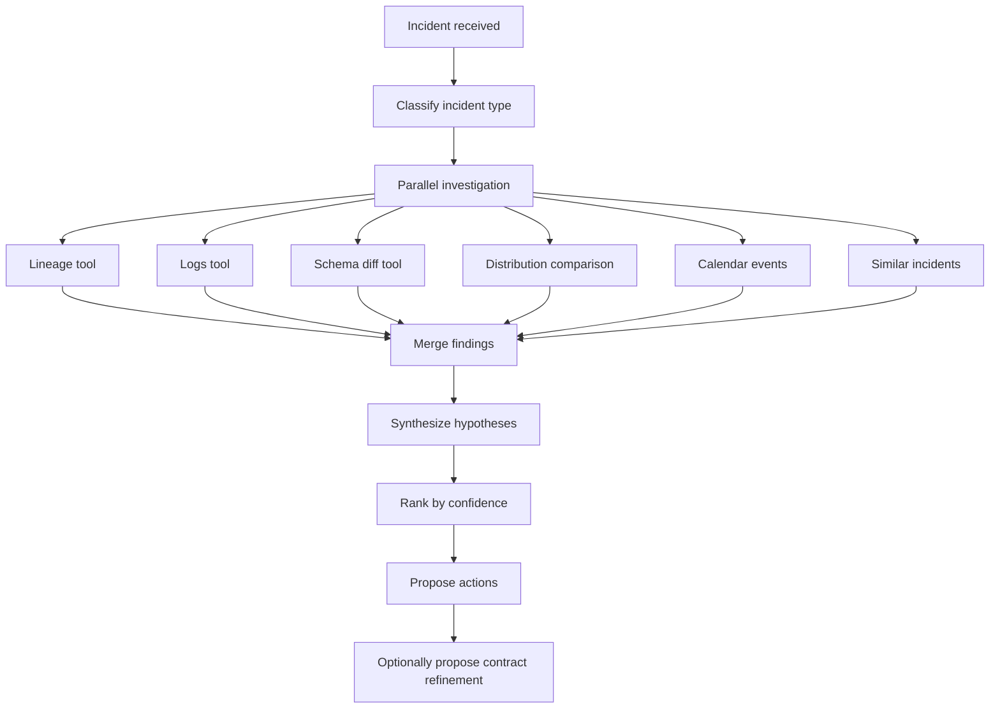

# Pactum architecture

This document describes how Pactum is put together: the layers, the agents, the tools, and the feedback loop. It's written for contributors and for anyone evaluating whether Pactum fits their stack.

If you want a 30-second overview, read the [README](./README.md) instead. This document goes deep.

## Philosophy

Three principles shape every design decision.

**Contracts and observability are the same problem.** Most tools treat them separately: contracts are a "governance" concern, observability is a "reliability" concern. In practice, a contract without live enforcement is a wishlist, and observability without semantic grounding is noise. Pactum unifies the two. Contracts are the source of truth that monitoring measures against, and monitoring findings refine contracts over time.

**LLM agents earn their place through tools, not prompts.** The intelligence of an agent lives in what it can *do*, not what it is told to think. Every agent in Pactum is defined by its tool surface first, its state graph second, and its prompt last. If you can achieve something with a tool, do not put it in the prompt.

**The feedback loop is the product.** A one-shot contract generator is a code-gen toy. A one-shot drift detector is what everyone else ships. Pactum is neither. It is the loop that connects them. Everything else exists to make that loop work.

## High-level architecture



Five layers, top to bottom:

1. **Foundation.** Orchestration, storage, and shared primitives.
2. **Contract Generator Agent.** Takes a source, produces a living contract.
3. **Monitoring.** Drift detection and contract adherence, running continuously.
4. **Causal Explanation Agent.** Investigates every incident, ranks hypotheses.
5. **Feedback loop.** Every incident feeds contract refinement.

## Foundation layer

The foundation exists to make the other layers boring to build.

**Orchestration.** Dagster is chosen over Airflow because it treats data quality and observability as first-class citizens: an asset-based paradigm, built-in asset checks, and native materialization tracking. Every source becomes a Dagster asset; every contract check becomes an asset check.

**Storage.** The contract registry lives in PostgreSQL. Contracts are versioned rows in the `contracts` table; every version is immutable and refinements create new versions with a link to their parent. Incidents and explanations also live in Postgres, linked by foreign keys. Sample and profile caches live in DuckDB — column profiles are cheap to compute and cheap to store; caching avoids reprofiling on every check.

**Agent framework.** LangGraph is chosen over LangChain (too much magic, unstable API) and the raw Anthropic SDK (too low-level for the state machines we need). LangGraph gives us explicit state graphs, which are essential for the causal agent's parallel investigation pattern.

**Lineage graph.** Pactum ships a minimal lineage subsystem. Sources and datasets are nodes; materializations and dbt models are edges. This is deliberately small — we do not try to compete with OpenLineage. If you already have OpenLineage, a Pactum adapter turns it into our internal graph.

## Contract Generator Agent

### State graph



The critical node is `Self-critique`. After drafting a contract, the agent re-reads its own output through a critique prompt that specifically looks for constraints without statistical justification, SLAs inferred from too little history, semantic classifications that contradict column names, missing PII flags, and omitted freshness or completeness expectations. If the critique surfaces issues, the agent revisits `Draft contract` with the critique as extra context. Two revisions maximum, then it commits with a warning list attached.

### Tools

Seven tools, all pure functions of `(source_id, ...) -> data`:

| Tool | Purpose |
|---|---|
| `inspect_schema` | DDL, types, existing constraints. |
| `profile_column` | Stats: null %, distinct count, min/max, distribution, top-K, cardinality tier. |
| `sample_data` | Stratified sample of N rows for the LLM to look at. |
| `classify_semantic_type` | LLM-based classification: PII, currency, code, timestamp, identifier, free text, etc. |
| `fetch_upstream_contract` | If the source derives from another contracted source, inherit its rules. |
| `fetch_business_context` | RAG on docs, wiki, README of the dataset. |
| `write_contract` | Validate against ODCS and persist. |

Adding a new tool: see [Adding a tool](./CONTRIBUTING.md#adding-a-tool) in the contributing guide.

### Output format

Contracts are stored as ODCS-compliant YAML with a Pactum extension namespace (`x-pactum:*`) for our own metadata: confidence scores, generation trace, and refinement history.

### Prompt design

Prompts are short. Most of the intelligence lives in the tool outputs, not the system prompt. The contract generator system prompt is under 400 tokens and mostly consists of role definition, output format spec, and self-critique invitation.

## Monitoring layer

Two subsystems run in parallel — statistical drift detection and contract adherence checks — and produce a unified `Incident` object.

### Statistical drift detection

The method depends on the column type:

| Column type | Method |
|---|---|
| Continuous numeric | Population Stability Index (PSI) and Kolmogorov-Smirnov two-sample test. |
| Discrete / categorical | Chi-squared test on frequency distributions. |
| Timestamp | Freshness delta (max timestamp vs current time). |
| Text | Embedding-space centroid drift (optional, expensive). |

The reference window is configurable per contract; the default is the last 14 days ending the day before the check.

### Contract adherence checks

Every rule in the contract becomes a check. Currently supported rule types: schema (columns present, types, nullability), range and enum constraints, regex constraints for text, freshness SLAs, completeness SLAs (null percentage thresholds), referential integrity (foreign-key-like semantics), and uniqueness constraints. Every violation becomes an `Incident` with a stable signature so identical incidents cluster.

### Incident structure

```python
class Incident:
    id: str
    dataset_id: str
    detected_at: datetime
    kind: Literal["drift", "violation"]
    severity: Literal["low", "medium", "high"]
    signature: str  # for clustering identical incidents
    payload: dict   # details specific to the incident type
    contract_version: str
```

## Causal Explanation Agent

This is the differentiating layer. It turns an `Incident` into an `Explanation` with ranked hypotheses.

### State graph



The parallel investigation pattern is why LangGraph was chosen. Each investigation branch runs independently, then merges findings before hypothesis synthesis. This scales linearly with investigation depth, not exponentially.

### Tools

Seven investigation tools:

| Tool | Purpose |
|---|---|
| `get_lineage` | Upstream and downstream datasets, up to depth N. |
| `fetch_pipeline_logs` | Execution logs of ingestion or transformation jobs in a time window. |
| `diff_schema` | Columns added, removed, or type-changed between two timestamps. |
| `compare_distributions` | Detailed comparison of two time windows: PSI, KS, top contributing buckets. |
| `fetch_calendar_events` | Deployments, holidays, regulatory changes (from a configurable calendar source). |
| `find_similar_incidents` | Vector retrieval on past incidents with their resolutions. |
| `query_contract_context` | The contract for this dataset plus glossary entries. |

### Hypothesis ranking

Confidence scores are the agent's own estimate, calibrated against three heuristics:

1. **Signal strength.** How many independent investigation branches point to the same hypothesis.
2. **Historical precedent.** Whether `find_similar_incidents` returned a matching prior case.
3. **Timing correlation.** Whether the timing of the drift aligns with a known event.

Confidence is not a probability. It is an ordinal score meant to help the user prioritize investigation follow-up.

### Similar incidents retrieval

Every resolved incident is embedded and stored. When a new incident arrives, we retrieve the top K similar past incidents by signature plus payload embedding. This is a simple but high-value pattern — teams see the same incidents over and over, and matching them to prior resolutions collapses investigation time.

### Reasoning trace

Every explanation stores its full reasoning trace: which tools were called, in what order, with what inputs and outputs. This is exposed in the UI as an expandable "why this hypothesis?" section. It is also crucial for building trust — nobody deploys an opaque LLM agent to production.

## Feedback loop

Every explanation can produce a `ContractRefinementProposal`. This is the closing move of the loop.

Types of proposals:

- **Constraint relaxation.** A rule was too strict (false positives).
- **Constraint tightening.** A rule missed a real issue.
- **New rule.** A pattern emerged that was not in the contract.
- **Scoping.** A rule should be conditional (for example, different ranges per currency).

Proposals never auto-apply. They go into a queue reviewable in the UI. Accepted proposals create a new contract version linked to the incident that triggered them.

## Storage and data model

Simplified schema:

```
contracts       (id, dataset_id, version, yaml, parent_version, created_at)
incidents       (id, dataset_id, kind, severity, signature, payload,
                 contract_version, detected_at)
explanations    (id, incident_id, hypotheses_json, actions_json,
                 trace_json, created_at)
refinements     (id, incident_id, contract_id, proposal_yaml,
                 status, reviewed_at)
lineage_edges   (from_dataset, to_dataset, edge_type, materialized_at)
```

Everything is append-only. Corrections happen through new rows, never updates. This makes the entire history auditable — important for compliance-adjacent use cases.

## Extensibility points

The four places you are most likely to want to extend Pactum:

1. **Add a new agent tool.** Drop a `@tool`-decorated function in `pactum/tools/` and register it in the relevant agent's tool list. See the [contributing guide](./CONTRIBUTING.md#adding-a-tool).
2. **Add a new drift metric.** Subclass `DriftDetector` in `pactum/monitoring/drift/` and register it in the detector registry.
3. **Add a new source adapter.** Implement the `SourceAdapter` protocol in `pactum/sources/`.
4. **Add a new lineage backend.** Implement the `LineageBackend` protocol. Pactum ships with in-memory, OpenLineage, and dbt manifest adapters.

## Tradeoffs and non-goals

Being explicit about what Pactum is *not*:

- **Not a full-fledged data catalog.** No search UI, no discovery, no team-level ownership graphs. Pactum stores what it needs to reason; it does not try to be Atlan or DataHub.
- **Not a streaming-first tool.** Batch monitoring is the default. Streaming support is planned but not for v1.
- **Not a multi-tenant SaaS.** Pactum is self-hosted or single-tenant. If you want SaaS, wrap it yourself.
- **Not a replacement for dbt tests.** dbt tests catch invariants at build time; Pactum catches drift at runtime. Use both.
- **Not a governance workflow tool.** Pactum surfaces refinement proposals; how your team approves them is out of scope.

## Further reading

- [README.md](./README.md) — the 30-second pitch.
- [CONTRIBUTING.md](./CONTRIBUTING.md) — how to help.
- [docs/contracts/](./docs/contracts/) — the ODCS extension spec.
- [docs/agents/](./docs/agents/) — deep dives on each agent's prompts and tools.
- [docs/evaluation/](./docs/evaluation/) — how we benchmark Pactum against baselines.
