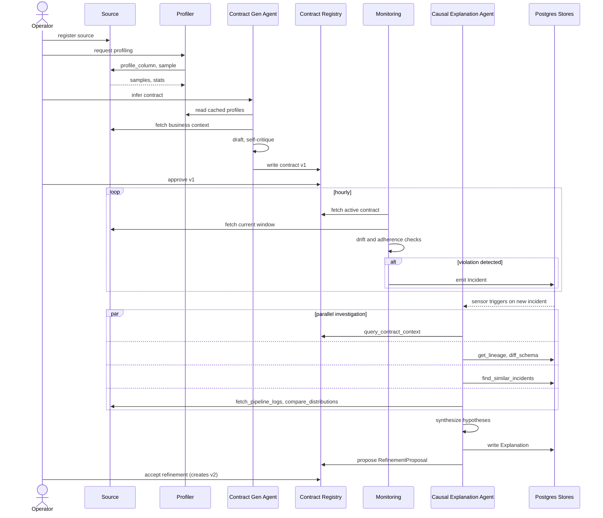

# Pactum — System Design Reference

This document is the technical reference for Pactum. It describes the end-to-end flow, the sequence of interactions between components, the component architecture, and the ownership boundaries that keep the system predictable.

For a 30-second overview aimed at adoption, see [README.md](./README.md). For infrastructure choices and technology rationale, see [ARCHITECTURE.md](./ARCHITECTURE.md). For the technology inventory, see [STACK.md](./STACK.md).

## Table of contents

1. [System overview](#1-system-overview)
2. [Primary end-to-end flow](#2-primary-end-to-end-flow)
3. [Primary sequence](#3-primary-sequence)
4. [Component architecture](#4-component-architecture)
5. [Ownership boundaries](#5-ownership-boundaries)
6. [Data model](#6-data-model)
7. [Failure modes](#7-failure-modes)
8. [Extensibility points](#8-extensibility-points)
9. [Observability](#9-observability)
10. [Non-functional requirements](#10-non-functional-requirements)
11. [Deployment topology](#11-deployment-topology)
12. [Security and privacy](#12-security-and-privacy)
13. [Non-goals](#13-non-goals)

---

## 1. System overview

Pactum is an AI-native data observability system that unifies data contracts and data quality monitoring through a closed feedback loop.

Three subsystems collaborate:

- A **Contract Generator Agent** infers a machine-readable data contract from a source.
- A **Monitoring layer** continuously checks live data against the contract and detects statistical drift.
- A **Causal Explanation Agent** investigates every incident and proposes both a hypothesis for the root cause and a refinement of the contract.

Every incident feeds back into the contract. Every refinement makes the system more accurate. The loop is the product.

---

## 2. Primary end-to-end flow

The happy path, from an unregistered source to a self-refining contract.

### Step 1 — Source registration
An operator declares a data source (SQL connection string, Parquet path, HTTP endpoint, or CSV file). The Source Adapter validates the connection and exposes it under a stable `dataset_id`

### Step 2 — Initial profiling
The Profiler runs `profile_column` on every column. Profiles are stored in the DuckDB profile cache. This step is cheap and idempotent — re-running it is a no-op if the source has not changed.

### Step 3 — Contract inference
The Contract Generator Agent is invoked. It runs a LangGraph state machine:
- `understand_source` — fetch schema, docs, business context.
- `profile_columns` — read profiles from the cache.
- `classify_semantics` — LLM classifies each column (PII, currency, timestamp, identifier, etc.).
- `draft_contract` — LLM writes an ODCS contract with `x-pactum:*` extensions.
- `self_critique` — LLM re-reads the draft looking for gaps. Two revision passes maximum.
- `write_contract` — validated and persisted as version 1 in the Contract Registry.

### Step 4 — Human approval
The operator reviews the contract in the Streamlit UI. Any manual edits are logged. Approval marks the contract as `active`. Only active contracts are monitored.

### Step 5 — Monitoring bootstrap
Dagster schedules two asset jobs per active contract:
- Statistical drift check (hourly by default).
- Contract adherence check (hourly by default).

The reference window for drift is the last 14 days before the contract went active.

### Step 6 — Incident emission
When a monitoring run detects a violation (schema mismatch, freshness lag, PSI over threshold, uniqueness broken), it emits an `Incident` record to Postgres. The Incident carries a stable signature, so identical incidents cluster.

### Step 7 — Sensor trigger
A Dagster sensor watches the incident table. When a new incident appears, the sensor invokes the Causal Explanation Agent as a Dagster op.

### Step 8 — Causal investigation
The Causal Explanation Agent runs a LangGraph state machine:
- `classify_incident_type` — determines investigation strategy.
- `parallel_investigate` — invokes 4–6 tools in parallel (lineage, logs, schema diff, distribution comparison, calendar events, similar incidents).
- `synthesize_hypotheses` — LLM produces 1–3 ranked hypotheses.
- `propose_action` — for each hypothesis, a concrete next step.
- `propose_refinement` — optionally, a contract refinement proposal.

### Step 9 — Explanation persistence
The Explanation is written to Postgres, linked to the Incident. It stores the full reasoning trace (which tools were called with what inputs and outputs).

### Step 10 — Refinement review
If a `RefinementProposal` was emitted, it appears in the operator's review queue. On acceptance, a new contract version is created with a parent link to the previous version.

### Step 11 — Loop closure
The new contract version becomes the reference for subsequent monitoring runs. The system now knows something it did not know before.

---

## 3. Primary sequence

Time-ordered interaction between components during a full lifecycle: source registration → contract inference → monitoring → incident → explanation → refinement acceptance.



Three phases are visible: initialization (steps 1–5 in the flow), monitoring loop, and incident resolution loop. The last two run indefinitely once initialization is complete.

---

## 4. Component architecture

Pactum is a **modular monolith by choice** — a single deployable process orchestrated by Dagster. Internally, it is decomposed into components with clear interfaces and responsibilities. This section documents each component: what it owns, what it depends on, and what it exposes.

### Source Adapter
- **Responsibility.** Read data from external sources uniformly.
- **Owns.** Connection lifecycle.
- **Depends on.** Nothing (bottom of the stack).
- **Exposes.** `list_datasets()`, `get_schema()`, `sample()`, `query()`.
- **Read-only.** Pactum never writes back to sources.

### Profiler
- **Responsibility.** Generate compact statistical profiles per column.
- **Owns.** The profile cache in DuckDB.
- **Depends on.** Source Adapter, DuckDB.
- **Exposes.** `profile_column()`, `merge_profiles()`.

### Contract Registry
- **Responsibility.** Store and version data contracts.
- **Owns.** The `contracts` table. All contract versioning.
- **Depends on.** PostgreSQL.
- **Exposes.** `create_version()`, `get_active()`, `get_version()`, `list_history()`.
- **Invariant.** Contracts are immutable. Every change is a new version linked to its parent.

### Contract Generator Agent
- **Responsibility.** Infer a first-draft contract from a source.
- **Owns.** No persistent state. Produces contract proposals; does not store them.
- **Depends on.** Source Adapter, Profiler, LLM Provider Factory, Contract Registry (for writing).
- **Exposes.** `infer_contract(source_id) -> ContractProposal`.

### Drift Detector
- **Responsibility.** Detect statistical drift on numeric, categorical, and temporal columns.
- **Owns.** No persistent state.
- **Depends on.** Source Adapter, Profiler, Contract Registry (for reference distributions).
- **Exposes.** `detect(dataset_id, column, window) -> DriftResult`.

### Adherence Checker
- **Responsibility.** Verify contract rules against live data.
- **Owns.** No persistent state.
- **Depends on.** Source Adapter, Contract Registry.
- **Exposes.** `check(dataset_id, contract_version) -> list[Violation]`.

### Incident Store
- **Responsibility.** Persist incidents raised by Drift Detector or Adherence Checker.
- **Owns.** The `incidents` table.
- **Depends on.** PostgreSQL.
- **Exposes.** `emit(incident)`, `get(id)`, `list_recent()`.
- **Invariant.** Incidents are append-only. No updates. No deletes.

### Causal Explanation Agent
- **Responsibility.** Investigate incidents and rank causal hypotheses.
- **Owns.** No persistent state directly. Emits Explanation and RefinementProposal.
- **Depends on.** Lineage Graph, Source Adapter, Contract Registry, Incident Store, Explanation Store, LLM Provider Factory.
- **Exposes.** `investigate(incident_id) -> Explanation`.

### Explanation Store
- **Responsibility.** Persist explanations and reasoning traces.
- **Owns.** The `explanations` table.
- **Depends on.** PostgreSQL.
- **Exposes.** `write(explanation)`, `get_for_incident(id)`, `find_similar(signature, top_k)`.

### Refinement Queue
- **Responsibility.** Hold proposed contract refinements until human review.
- **Owns.** The `refinements` table.
- **Depends on.** PostgreSQL.
- **Exposes.** `propose(refinement)`, `pending()`, `accept(id)`, `reject(id)`.

### Lineage Graph
- **Responsibility.** Represent upstream and downstream relationships between datasets.
- **Owns.** The `lineage_edges` table and the in-memory graph.
- **Depends on.** PostgreSQL.
- **Exposes.** `upstream(dataset, depth)`, `downstream(dataset, depth)`, `import_openlineage()`, `import_dbt_manifest()`.

### LLM Provider Factory
- **Responsibility.** Provide an LLM client abstracted over providers.
- **Owns.** Provider configuration.
- **Depends on.** External LLM APIs (Anthropic, Gemini, Groq, Ollama).
- **Exposes.** `get_llm(role="reasoning" | "fast") -> ChatModel`.
- **Invariant.** The only component that talks to LLM APIs.

### Orchestrator (Dagster)
- **Responsibility.** Schedule monitoring runs. Trigger causal investigation on incidents. Provide the runtime observability UI.
- **Owns.** Dagster's own state (run history, asset materializations).
- **Depends on.** All business components.
- **Exposes.** Assets, asset checks, sensors, schedules.

### UI (Streamlit)
- **Responsibility.** Human review of contracts, incidents, explanations, refinements.
- **Owns.** No state.
- **Depends on.** All store components (read-only).
- **Exposes.** Web pages. No public APIs.

---

## 5. Ownership boundaries

These are the rules that keep the system predictable. Every developer working on Pactum should be able to state these from memory.

### O1. The Contract Registry is the only writer of contracts
Contracts are versioned rows. No other component may INSERT into `contracts` or mutate its rows. Agents produce `ContractProposal` objects; only the registry's `create_version()` method writes them.

### O2. Contracts are immutable
Once a version is committed, it cannot be edited or deleted. Refinements always create new versions with a `parent_version_id` link. This keeps history complete and auditable.

### O3. Incidents are append-only
Incidents are the truth about what the monitoring layer saw at a moment in time. They are never updated. Retries or corrections are new incidents or new explanations, not mutations.

### O4. Only refinement acceptance creates new contract versions
Agents never mutate the active contract. They propose. Refinements sit in a queue until a human operator accepts them, which is what actually creates version N+1.

### O5. Only the LLM Provider Factory talks to LLM APIs
No other component may import an LLM SDK or call an API. This keeps the abstraction clean and allows swapping providers without touching agent code.

### O6. Source Adapters are read-only
Pactum never writes back to sources. Not for ETL, not for corrections, not for tagging. The interface has no `write()` method by design.

### O7. Agents own reasoning, not state
Agents produce Explanations, ContractProposals, RefinementProposals. They never mutate persistent state directly. They hand their outputs to store components which own the write.

### O8. Explanations are append-only per incident
An incident may have multiple explanations over time (a retry, a re-investigation with new data). Each is a new row; none is a correction of an older one.

### O9. Dagster owns scheduling
Business components never invoke each other on a timer. All periodic execution goes through Dagster schedules and sensors. This makes runtime behavior visible in one place.

### O10. Every component change respects backward compatibility of its exposed interface
Breaking changes require a major version bump and a migration path. This is enforced by mypy strictness on public interfaces.

---

## 6. Data model

Core entities and their lifecycle.

```
Contract
├── id: UUID
├── dataset_id: str
├── version: int
├── parent_version_id: UUID | None
├── yaml: str  (ODCS + x-pactum extensions)
├── status: draft | active | superseded
├── created_by: str  (agent or user id)
└── created_at: datetime

Incident
├── id: UUID
├── dataset_id: str
├── kind: drift | violation
├── severity: low | medium | high
├── signature: str  (for clustering identical incidents)
├── payload: JSONB
├── contract_version_id: UUID
└── detected_at: datetime

Explanation
├── id: UUID
├── incident_id: UUID
├── hypotheses: JSONB  (ranked list with confidence)
├── proposed_actions: JSONB
├── reasoning_trace: JSONB  (which tools were called, with what)
└── created_at: datetime

RefinementProposal
├── id: UUID
├── incident_id: UUID
├── source_contract_id: UUID
├── proposal_yaml: str
├── kind: relaxation | tightening | new_rule | scoping
├── status: pending | accepted | rejected
├── reviewed_by: str | None
└── reviewed_at: datetime | None

LineageEdge
├── from_dataset: str
├── to_dataset: str
├── edge_type: materialization | transformation | derivation
└── materialized_at: datetime
```

Every write is append-only. Every entity has a UUID and a timestamp. Foreign key relationships are enforced at the database level. All JSONB payloads have their shape validated by Pydantic before write.

---

## 7. Failure modes

What can go wrong and how the system responds.

### F1. LLM API is down
Contract generation and causal investigation both fail explicitly. No fallback to heuristic contracts. Monitoring continues to detect drift and violations (they do not depend on LLMs). Incidents accumulate; explanations are deferred. On API recovery, the sensor re-triggers the queued incidents.

### F2. LLM returns malformed output
Pydantic validation at the agent boundary rejects the response. The agent retries with a stricter reformat prompt. Two retries maximum. After max retries, the incident is marked `explanation_failed` with the raw LLM output preserved for offline debugging.

### F3. Source is unreachable during monitoring
The monitoring job fails cleanly. No incident is emitted — we cannot distinguish "source down" from "no drift". A separate "source health" asset check surfaces the outage.

### F4. Drift detected but no upstream lineage is known
The causal agent runs with reduced tool coverage. Hypotheses are marked with a lower confidence ceiling. The explanation explicitly states which investigation paths were unavailable.

### F5. Contract inference fails
The agent returns `ContractInferenceFailed` with the specific step (`profile`, `classify`, `draft`, `critique`) that failed. No partial contract is written.

### F6. Concurrent refinement acceptance
The Postgres unique constraint on `(dataset_id, version)` prevents version collision. The second acceptance sees the first version and reruns against the new parent.

### F7. Partial LangGraph state loss
LangGraph checkpoints its state to Postgres between nodes. On process restart during an agent run, the state is resumed from the last checkpoint. Ongoing tool calls are re-executed.

---

## 8. Extensibility points

The system is designed to be extended in four places.

### E1. New agent tool
Drop a `@tool`-decorated function in `pactum/tools/`. Register in the appropriate agent's tool list. See [CONTRIBUTING.md](./CONTRIBUTING.md#adding-a-tool).

### E2. New drift detector
Implement the `DriftDetector` protocol. Register in `pactum/monitoring/drift/registry.py`. Ships with PSI, KS, Chi-squared; extend with entropy, KL, EMD as needed.

### E3. New source adapter
Implement the `SourceAdapter` protocol. Register in `pactum/sources/registry.py`. Ships with Postgres, DuckDB, CSV, Parquet, HTTP; extend with Snowflake, BigQuery, S3, etc.

### E4. New lineage backend
Implement the `LineageBackend` protocol. Ships with in-memory, OpenLineage, dbt manifest; extend with Airflow, Prefect, custom sources.

Each extension point has: a protocol definition, a registry, and at least one example implementation to copy from.

---

## 9. Observability

Every meaningful event is captured and inspectable.

- **Structured logging.** `structlog` throughout. Every log entry carries `dataset_id`, `contract_version_id`, `incident_id` (as applicable).
- **Agent reasoning traces.** Every LangGraph node execution is captured to the `reasoning_trace` field of the resulting Explanation. Tool calls are logged with their inputs and outputs.
- **Dagster asset materialization history.** Every monitoring run, contract generation, and investigation appears in Dagster's timeline UI.
- **Postgres audit trail.** Every table is append-only, so history is the natural state.
- **Metrics (optional).** A `pactum/metrics/` module exposes counts (incidents per day, explanations per day) and durations (contract inference latency, investigation latency) via a Prometheus endpoint if enabled.

---

## 10. Non-functional requirements

Target service levels for a v1 self-hosted deployment.

| Requirement | Target |
|---|---|
| Contract inference latency | Under 60 seconds per source |
| Drift check latency | Under 30 seconds per dataset per window |
| Adherence check latency | Under 10 seconds per dataset per contract |
| Causal investigation latency | Under 90 seconds per incident |
| Concurrency | Up to 100 monitored datasets on a single node |
| Availability | Best-effort for POC. Single-node. No HA. |
| Durability | Postgres WAL plus daily snapshot recommended |
| Ingestion throughput | Not applicable — Pactum reads from sources, does not ingest |

These are targets for v1. Streaming and horizontal scale are v2+.

---

## 11. Deployment topology

Pactum is packaged as a single Docker Compose stack.

```
┌────────────────────────────────────────┐
│ pactum (single container)              │
│  ├── Dagster daemon                    │
│  ├── Dagster webserver                 │
│  ├── Streamlit UI                      │
│  └── Business components               │
├────────────────────────────────────────┤
│ postgres (Docker service)              │
├────────────────────────────────────────┤
│ duckdb (embedded, on-disk)             │
└────────────────────────────────────────┘
```

Everything runs on one host. Postgres is separated for durability. DuckDB is embedded for a zero-config profiling cache.

For production, run Postgres on managed infrastructure (RDS, Neon, Aiven, etc.). The Pactum container itself is close to stateless — it only holds the DuckDB cache. Loss of the container means re-profiling, not data loss.

---

## 12. Security and privacy

For a POC, security posture is minimal by design. This section documents what to consider for production adoption.

### Data sent to LLMs
The Contract Generator Agent sends column samples and statistics to the LLM. The Causal Explanation Agent sends investigation findings, including sample rows from failed cases. Deployers must consider provider terms:

- **Anthropic API paid tier** — data not used for training by default.
- **Google Gemini free tier** — data used for training outside the UK, EU, and EEA.
- **Ollama (local)** — no data leaves the host.

The `x-pactum:sensitivity` flag on any column marks it as "never sample to LLM"; the Profiler substitutes hashes or aggregates when the agent requests samples of such columns.

### Secrets
Managed via environment variables. A `.env.example` file is shipped; real `.env` files must never be committed. Postgres connection strings never appear in logs.

### Authentication
Not implemented in v1. The Streamlit UI is deployed behind a reverse proxy with authentication (Cloudflare Access, oauth2-proxy, or similar) for production use.

### Multi-tenancy
Not supported. Pactum is single-tenant. Deploy separately per tenant.

---

## 13. Non-goals

Explicit about what Pactum does not aim to be.

- **Not a data catalog.** No search UI, no discovery, no team-level ownership graphs.
- **Not a streaming-first tool.** Batch only in v1.
- **Not multi-tenant SaaS.** Self-hosted, single-tenant.
- **Not a replacement for dbt tests.** Complementary — dbt catches build-time issues, Pactum catches runtime drift.
- **Not a governance workflow tool.** Refinement approvals are single-user; sophisticated approval workflows are out of scope.
- **Not a paid product.** Fully open-source under Apache-2.0, self-hosted.

---

## Further reading

- [README.md](./README.md) — public-facing overview and quickstart.
- [ARCHITECTURE.md](./ARCHITECTURE.md) — infrastructure and technology rationale.
- [STACK.md](./STACK.md) — technology inventory with alternatives considered.
- [CONTRIBUTING.md](./CONTRIBUTING.md) — how to contribute code and docs.
- [docs/](./docs/) — deep dives on agents, contracts, and evaluation.
